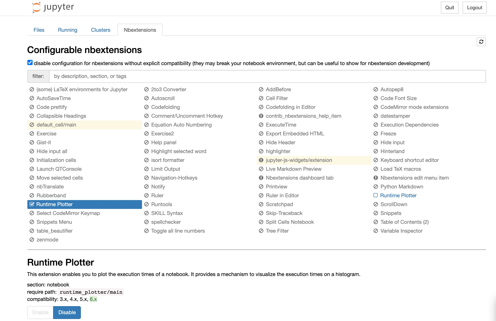
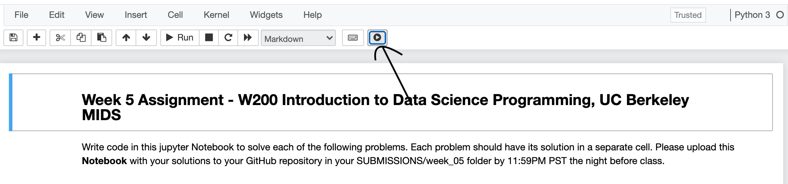
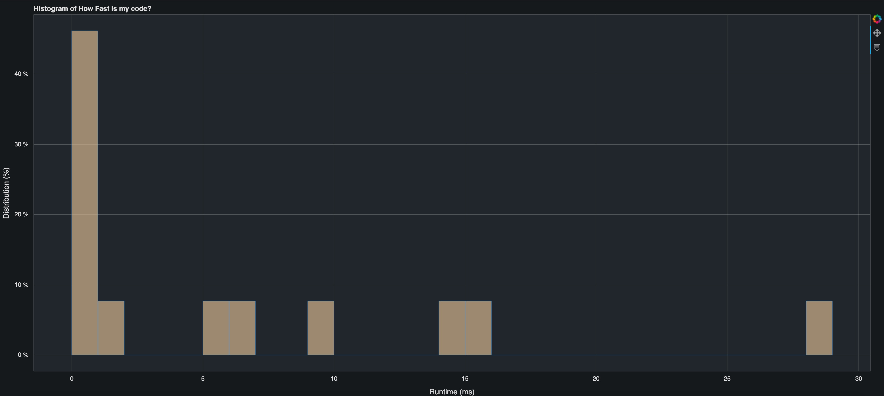

# Runtime Plotter

## Contact Details

```bash 
$ echo "Abdullahi Abdinur"
$ echo "Semester: Spring 2021"
$ echo "Email: aabdinur@berkeley.edu"
```

## Short Summary
This project has two items:
1. Full Scope
2. Scaled Down Scope

Since there was limited time to implement this project, I decided to scale it down based on instructors feedback. All the details of the scaled down version can be found in the **Project_1_Proposal.pdf**. 

In order to fully understand the scope of this project, please read the full scope which can be found in the lower half of the **Project_1_Proposal**.

## Project Structure
```
.
├── LICENSE
├── Project_1_Proposal.pdf
├── README.md
├── runtime_plotter_extension
│   ├── README.md
│   ├── description.yaml
│   ├── enable_extension.jpg
│   ├── main.js
│   └── play_button.jpg
├── runtime_plotter_src
│   ├── src
│   │   ├── __init__.py
│   │   ├── hist_plotter.py
│   │   ├── invalid_nb_error.py
│   │   ├── main.py
│   │   ├── nb_executor.py
│   │   ├── nb_processor_controller.py
│   │   ├── nb_processor_service.py
│   │   └── no_content_nb_error.py
│   └── test
│       └── HW_Unit_05.ipynb
└── setup.py
```

## Project Description

This project contains two components:

1. Jupyter Notebook Extension
2. Extension Processing (Backend Service)

### Jupyter Notebook Extension
The extension code can be found in runtime_plotter_extension and to install the extension, do the following:

```
# If using linux/Mac, this should suffice
$ python setup.py

# If using Windows, provide the below options
# user_name for your username
$ python setup.py -o win -u <user_name>

# When extension is setup, please run your jupyter notebook
$ jupyter notebook
```

To enable the extension:

Navigate to Nbextensions and enable the extension as shown below:


### Extension Processing (Backend Service)
The processing service is written in python and to run it, here are the steps:
```
# Application starts up on localhost port 8000 by default
$ python runtime_plotter_src/src/main.py

# If default needs to be changed
# And update runtime_plotter_extension/main.js to use the correct port
$ python runtime_plotter_src/src/main.py -p <port_number>
$ const url = 'http://localhost:<port_number>/notebook_data'
```

### Testing
There is a test notebook provided in runtime_plotter_src/test.
Press the 
This extension should work on all other notebooks as well.
A couple of things to be aware:
1. The extension will navigate you to the command line if there is an input required from user
2. If there are any exceptions during execution, application logs the exception but there won't be an error to the user.

#### Sample Result



### References Used
[Ascii-Hex color mapping](https://htmlcolorcodes.com/color-names/)

[Jupyter Notebook Extension Example](https://towardsdatascience.com/how-to-write-a-jupyter-notebook-extension-a63f9578a38c)

[Docs for creating bokeh charts](https://docs.bokeh.org/en/latest/index.html)

