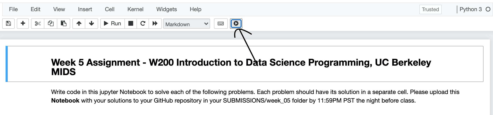

Runtime Plotter
=========
Plots the execution times of a notebook. Navigate to the relevant notebook you would like to check the execution times and press the play button at the top of the notebook as shown below. 

This extension is a work in progress and any help would be appreciated. Feel free to make contributions on GitHub or contact the author (Abdullahi Abdinur) at aabdinur@berkeley.edu